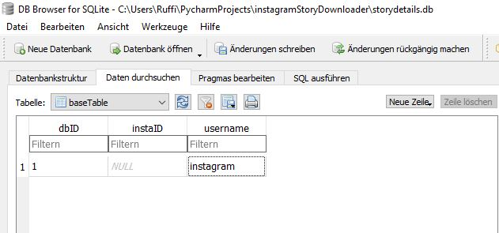

# instagramStoryDownloader

A script to download Instagram Stories from any account you are permitted to see content from. 
<small>(Public Profiles and private ones your account is following)</small> 

## Setting everything up

<ul>
<li>After cloning the repository open databaseConfig.py and go to line 77/78 delete the "#" and run the script to create the database.</li>
<li>Comment out line 77/78 after running the script once.</li>
<li>Now use any <a href="https://sqlitebrowser.org/">DB-Browser</a> to add Instagram Usernames to the table named "baseTable" and save the changes.
 There is no need to add the instaID by yourself!</li>
</ul>
 
  

<ul>
<li>All there is to do now is running the downloadInstaStory.py</li>
<li>The created directories are named after the IDs the User has inside the baseTable</li>
</ul>

## Dependencies
Package | Version 
---------|----------
requests | 2.23.0 
<a href="https://github.com/Dominik-CH/instagram-scraper">IGscraper Fork</a> | 0.3.2
